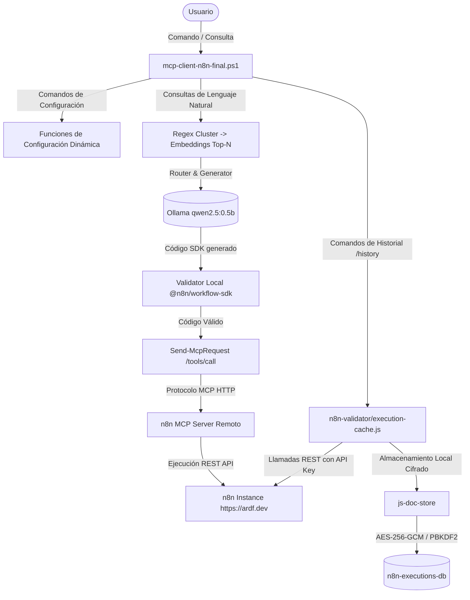

# Guía Completa de Documentación - Agente n8n MCP Local v3.0

Esta documentación describe la arquitectura, la caché de historial local y los comandos de configuración dinámica implementados en el cliente interactivo MCP de n8n (`mcp-client-n8n-final.ps1`).

---

## 🏗️ 1. Arquitectura General del Sistema

El Agente n8n MCP Local combina el protocolo de comunicación de Modelos (MCP) con una caché documental local cifrada de alta performance y validación estricta de código antes del despliegue.



---

## 💾 2. Sistema de Historial de Ejecuciones Local (`js-doc-store`)

Para permitir auditorías de ejecución rápidas y offline, el cliente integra la base de datos documental **`js-doc-store`** (una librería ligera, zero-dependencies, de alta performance en un solo archivo).

### 🔍 Indexación y Performance
Para garantizar consultas de ejecución instantáneas directamente en la terminal, se configuran los siguientes índices automáticos al inicializar la base de datos:
1. **Hash Index en `status`**: Optimiza filtros de ejecuciones exitosas o fallidas (`/history -filter status failed`).
2. **Hash Index en `workflowId`**: Acelera búsquedas por identificador de flujo.
3. **Sorted Index en `startedAt`**: Mantiene las ejecuciones ordenadas cronológicamente para consultas rápidas sin sobrecargar la memoria.

### 📊 Pipelines de Agregación (`stats`)
Utilizando las capacidades de agregación nativas de `js-doc-store`, el sistema agrupa y combina colecciones de forma similar a MongoDB:
* **Lookup (Join)**: Combina la colección `executions` con `workflows` para extraer el nombre legible de cada flujo.
* **Agrupación y Acumuladores**: Calcula en tiempo real:
  - Total de ejecuciones ejecutadas.
  - Porcentaje de éxito (`successCount / totalRuns`).
  - Porcentaje de fallo (`failedCount / totalRuns`).
  - Duración promedio en segundos de cada flujo.

---

## 🔒 3. Seguridad Militar At-Rest (Cifrado AES-256-GCM)

Toda la información de flujos, nombres de variables y registros de ejecución se protege contra accesos no autorizados en disco mediante un adaptador criptográfico seguro:

* **PBKDF2 para Derivación de Llaves**: A partir de la contraseña maestra del usuario, se deriva una llave simétrica de 256 bits aplicando **100,000 iteraciones** de `SHA-256`.
* **Cifrado AES-256-GCM**: Cada colección se encripta de forma independiente en disco. Los archivos crudos se almacenan en formato JSON envueltos en un campo `__enc`:
  ```json
  {"__enc":"AbGp5MabFka7ZndUPAV1w3QfTVPlJ3XZXvdEGcAv..."}
  ```
* **Migración Automática y Transparente**: Si existía una base de datos previa en texto plano y el usuario configura una contraseña por primera vez (`/history -secure <password>`), el sistema:
  1. Carga los datos plano en memoria.
  2. Purga y elimina los archivos JSON sin cifrar del disco de forma segura.
  3. Escribe los archivos protegidos con AES-256-GCM de manera transparente.
* **Validación de Contraseña**: Si se intenta consultar los registros con una clave incorrecta, el sistema captura el fallo, protegiendo los datos en memoria sin colapsar el programa y sugiriendo el comando de desbloqueo.

---

## ⚙️ 4. Configuración Dinámica (Funciones y Comandos)

Se han añadido funciones internas en PowerShell y comandos especiales en la consola interactiva para modificar la configuración en caliente de forma robusta y segura:

### 🔹 Funciones de PowerShell
Estas funciones pueden invocarse en el script interactivo o desde otros módulos de automatización:
1. **`Set-McpToken -Token <token>`**: Establece el token Bearer para autenticación contra el servidor MCP.
2. **`Set-N8nApiKey -ApiKey <key>`**: Define la API Key de n8n para realizar llamadas REST de sincronización.
3. **`Set-N8nDomain -Domain <url>`**: Establece el dominio o base URL de n8n (ej. `https://ardf.dev`). Cuenta con auto-completado de protocolo (`https://` por defecto) y eliminación de diagonales finales.

### 🔹 Slash Commands Interactivos
Escribe estos comandos directamente en el prompt `[usuario]` del cliente interactivo:

* **`/token <token>`** o **`/mcp-token <token>`**  
  *Actualiza el token Bearer del MCP en caliente.*
* **`/apikey <key>`** o **`/n8n-apikey <key>`**  
  *Define la API Key para sincronización.*
* **`/domain <url>`** o **`/n8n-domain <url>`**  
  *Establece el dominio de n8n de forma dinámica.*
* **`/status`**  
  *Muestra la configuración actual de forma segura. Las llaves y tokens sensibles se enmascaran automáticamente (`eyJhbGciOi...BKTcUjVsj0`) para evitar filtraciones accidentales.*
* **`/help`**  
  *Lista y explica todos los comandos de configuración e historial disponibles.*

---

## 🚀 5. Guía de Uso del Historial Local Cifrado

Sigue estos pasos dentro del cliente interactivo para aprovechar el historial al máximo:

### 1. Activar el Cifrado Seguro de la Base de Datos
La primera vez, o para cambiar tu contraseña de cifrado, ingresa:
```bash
/history -secure miContraseñaSuperSecreta
```
*Si la base de datos estaba en plano, se migrará automáticamente.*

### 2. Sincronizar el Historial Incrementalmente
Trae los últimos datos de ejecuciones y nombres de workflows desde el servidor remoto a tu base local en disco (usando la API Key y dominio definidos):
```bash
/history -sync
```

### 3. Visualizar Estadísticas y Métricas de Confiabilidad
Genera una tabla ASCII premium que resume el éxito, fallos y duración media de ejecuciones por workflow:
```bash
/history -stats
```

### 4. Listar Ejecuciones Recientes
Muestra los últimos 10 o 20 ejecuciones con colores identificadores de status (Verde para éxitos, Rojo para errores):
```bash
/history -list 10
```

### 5. Filtrar Ejecuciones en Segundos
Filtra por campos específicos gracias a los índices pre-construidos en disco:
```bash
/history -filter status failed 5
/history -filter workflowId kpdj9ONJHnTB0xFI 10
```

---

> [!NOTE]
> Todos los cambios han sido validados utilizando el validador AST sintáctico (`parse-ast.ps1`), garantizando 0 errores sintácticos en entornos Windows con PowerShell 5.1 y PowerShell 7+.
