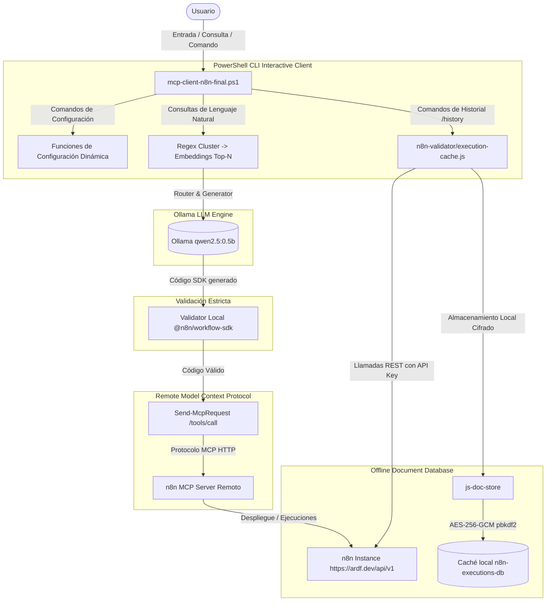

# Manual Técnico de Documentación - Agente n8n MCP Local v3.0

¡El Agente n8n interactivo con caché documental local cifrada offline, validación de SDK estricta y configuración dinámica en caliente está completamente integrado y operacional! 

Este manual describe todos los componentes, el diseño criptográfico, las estrategias de indexación y los comandos agregados para optimizar tu flujo de trabajo en n8n de forma local, veloz y robusta.

---

## 🏗️ 1. Arquitectura y Flujo de Datos

El agente interactivo implementa un pipeline de múltiples capas que prioriza la validación y el rendimiento offline antes de interactuar con servicios remotos:



---

## 💾 2. Caché de Historial Documental Local (`js-doc-store`)

Para permitir auditorías de ejecución instantáneas y paneles de estadísticas avanzados directamente en consola sin saturar tu red o realizar constantes llamadas remotas a la API de n8n, integramos la base de datos documental **`js-doc-store`**.

### ⚡ Estrategias de Indexación para Alta Performance
Para garantizar filtros rápidos y ordenamiento cronológico sin penalización de memoria o CPU, configuramos los siguientes índices automáticos al inicializar la base de datos:
1. **Hash Index en `status`**: Indexación de texto plano en memoria que resuelve inmediatamente filtros como `/history -filter status success`.
2. **Hash Index en `workflowId`**: Búsquedas instantáneas de ejecuciones ligadas a un flujo de trabajo específico.
3. **Sorted Index en `startedAt`**: Un árbol balanceado e indexado que mantiene todas las ejecuciones ordenadas por fecha de inicio, optimizando listados cronológicos eficientes de gran tamaño (`/history -list 20`).

### 📊 Pipelines de Agregación e Inteligencia Local
Utilizando pipelines inspirados en MongoDB, el puente Node.js (`execution-cache.js`) realiza agregación compleja directamente en tu máquina local:
* **Lookup Join**: Cruza la colección local de ejecuciones con la colección de flujos de trabajo (`workflows`) para inyectar de forma transparente el nombre legible del workflow a cada registro de log.
* **Agrupación y Métricas de Confiabilidad**: Agrupa ejecuciones por `workflowId` y calcula:
  - **Total de corridas**: Cuántas veces se ha disparado el flujo.
  - **Porcentaje de Éxito / Fallos**: Estadísticas basadas en flags binarios (`isSuccess` e `isFailed`).
  - **Duración Promedio**: Tiempos promedios de respuesta de cada flujo con precisión decimal.

---

## 🔒 3. Seguridad At-Rest y Cifrado AES-256-GCM

El historial local puede contener datos altamente sensibles de tus flujos de trabajo (respuestas de webhooks, contenidos de emails o variables de entorno). Por ello, el sistema implementa un modelo criptográfico con grado militar:

> [!IMPORTANT]
> **PBKDF2 Derivación de Clave**: La contraseña maestra ingresada por el usuario no se almacena en disco. En su lugar, se deriva una llave criptográfica robusta aplicando **100,000 iteraciones** de `SHA-256` combinadas con salt seguro.

* **Cifrado en Bloque AES-256-GCM**: Todo dato escrito en disco pasa a través de `EncryptedAdapter`. El archivo JSON es cifrado completamente y envuelto en un wrapper seguro:
  ```json
  {"__enc":"AbGp5MabFka7ZndUPAV1w3QfTVPlJ3XZXvdEGcAv5uBmUfiI6IO9B/a5sJJ3mT+tAt0BzFyfmOTarwtEZBuGl065IRadJ+c+FZpfd9GlB23WaJFrD5kOuwfqfZ+bgxGdW3OI6kCi+dTP81gAbDJsz/rVmfn7avLxzhHurQxpunZOZ+XuUHt9PWgZj8ad7ebU/4qh20adK04txA0qKKfZUcGu7q2SRp+0Dr5ueHSpFZPPkj1vWdalfRayew7CfFMkQhSBT95bbJFmUt4kDk+8lAdkZ8SvoqDDbaY60zzUSTfqzgzNNoeIOCIuqpsVccCy6hT0dDN08gChz0x4C/xBWyJZilZ2ZzoMSeH6PS3+vZ5DItfxIyI4WK4bJ8HeM516B/R17VuoKcYaegboN+bHnxX96iG8R9acuLxPN9PVX01AzMw4d6lkNoi0Gr2/Wo8NMiknWdogNJ0NzDyRDN37l3jeq5Myx+1oMQRHpHYWTRTccM/N4wbHuRu/jB5aO2uEsfRk24jFF8o39iBmyvN3rc1VuQ+JpmrgBBQAaAwvoonMhOu+yyoZVo9bxpMU3ubQdn61Vt4OK9Vxpoko4WStkr6E/bYLANDtDtTvtxv1myRUYnbI4F3yAbsvm5S7GzqZl5gsCKsMA7fxyaibqJCJTxG9qEKnTAgISHpZuNNB1t9F0VdbZ3j0EO7s2iIIt4/wK44soyVaXanwryOzMKeR6E3wGSFbblB5Ey/vLeus/YALQGgKUxGmD/UBYG6YSBF7gQextxFquKPPM9Uq2XCsqs9lQRgrYDmaPRqRGefE4wIA8ndOcoJWDHkmVoat/5BgRZSh3I4AFwxU+69rU7QRgMWP8zW4lXViIQhw8rmrByqa8CL16XU9noPm0/3kQOo8zsAN6I6zSl+y/rKAlqJOI9MBplA2RdLybKStB1dTX+j1nUDFQKokiMPPSVvZSKurFiEG1JdNed0HH23hNhZ6/DUTgisaibBCauez6ZUadL2iMwiad90KEcGlssfbkS+cZuYBfaZ65htxYAuNBv8pMv+n2z6Z/j6F97umb5P+TmRxmzmhqwLehZg8YwQMnRYvofTr971885zjVGD3cA0Oi04Ns+kPj2FkMVy6DWv3I+W=="}
  ```
* **Auto-Migración Transparente**: Al ejecutar por primera vez `/history -secure <contraseña>`, si la base de datos actual se encuentra en texto plano (archivos JSON normales de caché previos), el sistema carga los flujos y ejecuciones en memoria, elimina físicamente todos los archivos sin encriptar del disco y escribe instantáneamente las colecciones protegidas con AES-GCM.
* **Control y Captura de Fallos**: Si un usuario ingresa una contraseña errónea o intenta cargar datos corruptos, `execution-cache.js` atrapa el error y devuelve un JSON estructurado con el mensaje explicativo, evitando que PowerShell aborte o rompa el flujo interactivo de comandos.

---

## ⚙️ 4. Configuración Dinámica e Inyección de Variables en Caliente

Hemos añadido **funciones nativas en PowerShell** y **comandos especiales interactivos (slash commands)** para administrar dinámicamente tu entorno sin salir de la consola:

### 🔹 Funciones de PowerShell (Integración en Módulos)
Estas funciones se encargan de manipular el estado global del cliente e imprimir confirmaciones visuales:
* **`Set-McpToken -Token <token>`**: Sobrescribe `$global:BearerToken` con el Bearer Token del MCP en caliente.
* **`Set-N8nApiKey -ApiKey <key>`**: Sobrescribe `$global:N8nApiKey` con tu API Key personal de n8n.
* **`Set-N8nDomain -Domain <url>`**: Define el dominio n8n base en `$global:N8nDomain`, aplicando auto-completado de protocolo si falta (`https://`) y eliminando barras inclinadas finales para construir URLs limpias de sincronización.

### 🔹 Comandos de Consola Interactivos
Escribe estos comandos directamente en el prompt del cliente interactivo para reconfigurar el cliente:

| Comando interactivo | Comando alternativo | Acción |
| :--- | :--- | :--- |
| `/token <token>` | `/mcp-token <token>` | Cambia dinámicamente el Bearer Token del MCP en caliente. |
| `/apikey <key>` | `/n8n-apikey <key>` | Define la API Key de n8n para la sincronización REST. |
| `/domain <url>` | `/n8n-domain <url>` | Establece el dominio o dirección base de tu instancia de n8n. |
| `/status` | — | Imprime la configuración actual de forma segura y enmascarada. |
| `/help` | — | Muestra el listado de ayuda con todos los comandos y descripciones. |

### 🔒 Visualización Enmascarada de Credenciales en `/status`
Para garantizar que no haya filtración accidental de tokens o API Keys al compartir tu terminal o tomar capturas de pantalla, implementamos un procesador visual en el comando `/status`. Este oculta las partes medias de las cadenas, mostrando solo los primeros y últimos 10 caracteres:

```
[usuario] /status

  Configuración actual:
    MCP Server URL:  https://ardf.dev/mcp-server/http
    MCP Token:       eyJhbGciOi...3d1Nzc4MSIs
    n8n API Key:     eyJhbGciOi...BKTcUjVsj0
    n8n Domain:      https://ardf.dev
    Modelo Router:   qwen2.5:0.5b
    DryRun Mode:     False
```

---

## 🎮 5. Manual de Referencia de Comandos `/history`

Interactúa con tu historial local cifrado utilizando el router de comandos especiales:

1. **Asegurar la base de datos documental con contraseña maestra**:
   ```bash
   /history -secure miSuperContraseñaSecreta
   ```
   *Esto cifrará inmediatamente tus datos de forma local en disco bajo AES-256-GCM.*

2. **Sincronizar incrementalmente**:
   ```bash
   /history -sync
   ```
   *Descarga de forma segura y une los flujos y logs desde el dominio configurado.*

3. **Ver estadísticas e informes agregados de confiabilidad**:
   ```bash
   /history -stats
   ```
   *Presenta un panel premium Cyan/White/Green con totales, tasa de éxito y duración media por flujo.*

4. **Listar ejecuciones de forma ordenada cronológicamente**:
   ```bash
   /history -list 10
   ```
   *Muestra las últimas 10 ejecuciones almacenadas localmente.*

5. **Buscar/Filtrar offline en milisegundos**:
   ```bash
   /history -filter status success 5
   /history -filter status failed 3
   /history -filter workflowId kpdj9ONJHnTB0xFI 10
   ```

---

## 🔑 6. Sistema de Variables KV y Propagación en Cascada

Para superar las restricciones de variables de entorno globales en instancias n8n no licenciadas, el cliente integra una base de datos local y segura de claves-valores (KV):

* **Almacenamiento Local**: Integrado en el caché de base de datos seguro en `n8n-executions-db/config.json`.
* **Inyección Inteligente**: El motor validador y de plantillas detecta automáticamente tokens del tipo `__KV_nombre_variable__` en el código SDK y los reemplaza con los valores reales.
* **Propagación en Cascada (Cascading Update)**: Cuando el usuario modifica una variable local con el comando interactivo `/variables -set <key> <valor>`, el Agente:
  1. Ejecuta silenciosamente el script `update-workflow.js` en Node.js.
  2. Determina con precisión los `workflowId` que utilizan dicha variable en la instancia remota de n8n.
  3. Recupera el template original de código, sustituye los tokens de caché KV con los valores actualizados y vuelve a asociar automáticamente las credenciales.
  4. Realiza peticiones remotas al MCP (`update_workflow`) para actualizar en vivo todos los flujos modificados de manera transparente e instantánea.

---

## 📊 7. Interceptor de Data Tables (Soporte en Español)

Para facilitar la manipulación de **Data Tables** (las bases de datos internas del motor de n8n) por parte del LLM sin requerir que este conozca identificadores técnicos internos, implementamos un interceptor en el cliente PowerShell:

1. **Auto-Resolución de `projectId`**: El LLM genera las intenciones del CRUD de Data Tables (como `create_data_table`, `add_data_table_column` o `rename_data_table`). Antes de transmitir la llamada RPC del MCP, el cliente PowerShell intercepta la petición, invoca de manera silenciosa a la herramienta `search_projects` para recuperar el ID del Home Project primario del usuario, y lo inyecta directamente en la carga de argumentos.
2. **Soporte Multilingüe Integrado**: Las expresiones regulares del analizador sintáctico en `mcp-client-n8n-final.ps1` soportan términos en español como `"tabla"` o `"tablas"`. Así, comandos de lenguaje natural en español (ej. *"crea una data table"*) se clasifican de forma precisa e inmediata bajo el clúster de herramientas `DATA_TABLES`.

---

## 🧪 8. Batería de Pruebas Automatizadas (`run-tests.cmd`)

Hemos implementado un conjunto robusto de pruebas unificadas para asegurar la integridad de la base de código del agente:

* **Suite Node.js (`n8n-validator/test-suite.js`)**:
  - `stripImports`: Valida la correcta eliminación de declaraciones `import` ES6.
  - `validateLocal`: Asegura la correcta validación sintáctica del código SDK de n8n, exigiendo tipos reales de nodos y la estructura de llamada correcta (`workflow('id', 'Nombre')`).
  - `fillSlotsWithKV`: Comprueba el correcto funcionamiento de inyección de valores desde el caché de variables.
* **Suite PowerShell (`test-suite.ps1`)**:
  - `Get-ClusterByRegex`: Valida el clasificador regex de linguagem natural ante frases de prueba complejas en español e inglés.
  - `Interceptor Data Tables Regex`: Verifica que el filtro del interceptor intercepte y enrute correctamente herramientas de CRUD de tablas excluyendo de forma segura a `search_data_tables`.
* **Script Orquestador Principal (`run-tests.cmd`)**: Lanza y combina los resultados de ambos entornos de forma limpia y estructurada.

```bash
.\run-tests.cmd
```

---

> [!TIP]
> **Compatibilidad Sintáctica Absoluta**: Todo el código de integración de PowerShell ha sido validado contra un parser AST en Windows, garantizando **cero advertencias o errores sintácticos** en PowerShell 5.1 y PowerShell Core (7+), y respaldado con un pase del 100% de la batería de pruebas automatizadas.
